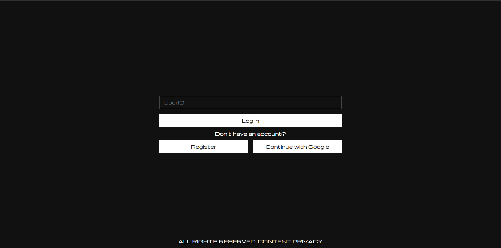
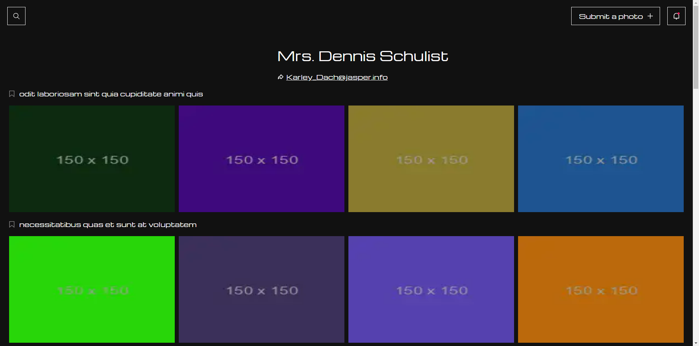
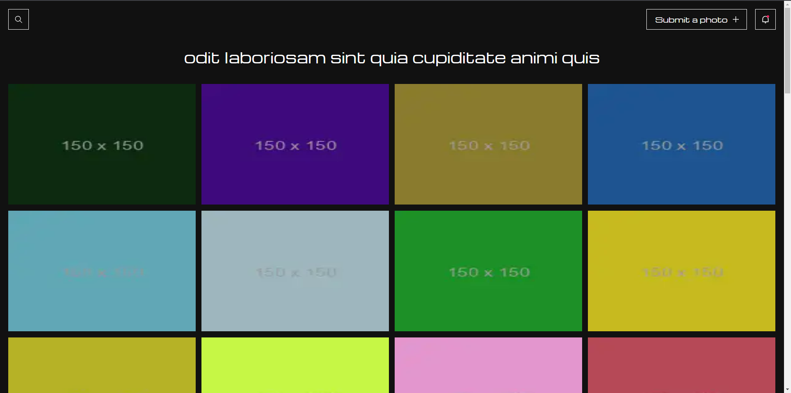
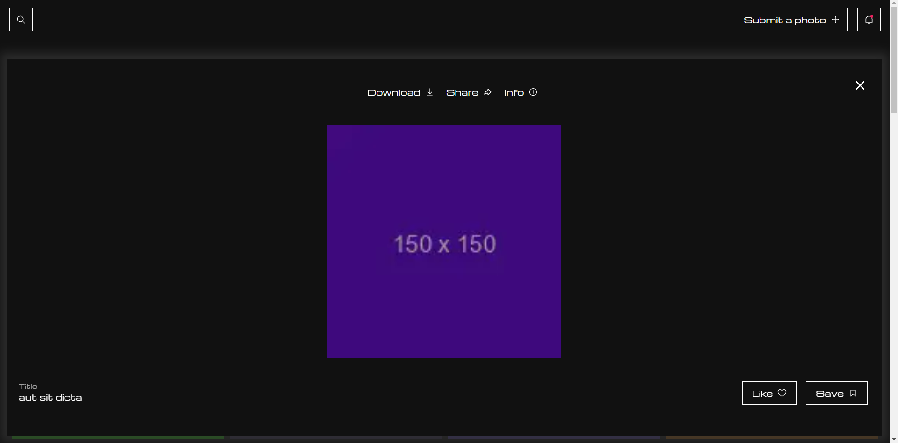

# README 




## 功能

測試帳號 **（透過API:https://jsonplaceholder.typicode.com/）**

```bash
帳號： 1
```

- [x] 登入
- [x] 相簿列表
- [x] 相⽚列表
- [x] 相⽚ Popup

...

## 畫面






## 安裝


以下將會引導你如何安裝此專案到你的電腦上。

Next.js 版本建議為：`14.0.1` 

### 取得專案

```bash
git clone git@github.com:Gexianss/ECTest.git

### 移動到專案內

```bash
cd ECTest
```

### 安裝套件

```bash
npm install
```

### 環境變數設定

請在終端機輸入 `cp .env.example .env` 來複製 .env.example 檔案，並依據 `.env` 內容調整相關欄位。

### 運行專案

```bash
npm run dev
```

### 開啟專案

在瀏覽器網址列輸入以下即可看到畫面

```bash
http://localhost:3000/login
```

## 資料夾說明

- pages - 畫面放置處
- context - 應用程式相關連結放置處
- component - 模組放置處
- styles - scss 檔案放置處
- public - 圖片放置處

## 專案技術

- Next.js v14.0.1
- React v18.2.0 
- React Icons v4.12.0
- React Modal v3.16.1

## 相關開發工具

- ESLint v8
- Prettier v2.8.8
- eslint-config-next v14.0.1
- eslint-config-prettier v8.8.0